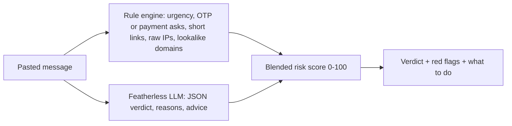

# 🛡️ ScamCheck — AI scam message checker

**Track:** AI + Cybersecurity · Built during ForgeHacks Online 2026 (Oct 3–10).

## Problem
AI-written phishing SMS, fake KYC alerts, delivery-fee scams and lookalike links fool millions, especially first-time smartphone users. People need a quick second opinion **before** they click or share an OTP.

## Who it's for
Anyone who receives a suspicious SMS, email or DM: students, parents and elderly users.

## How it works

- **Rule engine:** regex signals, plus lookalike-domain detection (`difflib` similarity against ~25 bank, shopping and government brand domains, e.g. `paypa1.com`).
- **LLM analyst:** an open model served through Featherless returns structured JSON.
- **Score:** 40% rules + 60% LLM. Without an API key it falls back to rules only.

## Run
```bash
pip install -r requirements.txt
export FEATHERLESS_API_KEY=...   # optional
streamlit run app.py
```

## What works
- Five built-in examples (bank KYC, delivery fee, job scam, PayPal lookalike, legit message).
- Lookalike and shortened link detection, plus an AI verdict with advice.
- Graceful fallback when the AI is unavailable.

## What doesn't (yet)
- Text only: no screenshot OCR or voice-call scams.
- The brand list is small and hard-coded.
- Rule weights are hand-tuned and not yet evaluated on a labelled dataset.

## Next
Screenshot OCR, a WhatsApp/Telegram bot front end, and live domain-age/WHOIS checks.
